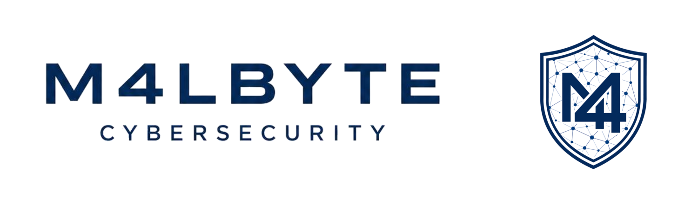

  

<h1 align="center">Juan Malbrán</h1>
<h3 align="center">Ciberseguridad · Blue Team / SOC · Detección de Amenazas</h3>

  
  
  
  

---

## Sobre mí

Profesional del sector **IT** orientado a la **ciberseguridad**, con foco en **Blue Team / SOC** y detección de amenazas. Acabo de completar el **Bootcamp Full Stack Cybersecurity de KeepCoding**, cubriendo el ciclo completo: del reconocimiento y la explotación ofensiva a la defensa, el análisis forense y la detección en un SOC. Mi prioridad es el **Blue Team / SOC**, con una base ofensiva que me da la foto completa del ciclo ataque-defensa.

Mi diferencial no es solo lo que estudié, sino **cómo lo estudié**: construí una base de conocimiento propia y estructurada (diagramas, mapeos a MITRE ATT&CK y NIST, evidencias reales de cada práctica) porque entender de verdad se demuestra pudiendo explicarlo, no solo repitiéndolo.

Mi recorrido en IT arrancó en el mundo digital: soy **Licenciado en Diseño y Animación Digital** (Universidad Siglo 21) y trabajé en empresas de videojuegos y cortometrajes animados. Esa etapa me dejó lo que de verdad pesa al sumarse a un equipo: **responsabilidad, autonomía, proactividad y el compromiso de entregar con calidad y en tiempo**.

---

## Proyecto destacado

  

<h3 align="center">Nullsec · SIEM + Threat Intelligence</h3>

  Ciclo de <strong>detección de amenazas de extremo a extremo</strong>: un IOC cargado en MISP dispara una alerta real en el SIEM tras la ejecución controlada de ransomware (<strong>Bad Rabbit</strong>). 
  Diseñé el <strong>núcleo de detección</strong>: SIEM con ELK Stack (Elasticsearch · Kibana · Logstash), Fleet Server, integración <strong>ti_misp</strong> y <strong>4 reglas KQL</strong> que detectaron el ataque.

  <strong>MTTD 5-6 min</strong> · 484 IOCs sincronizados · 46 eventos Sysmon · detección validada de PowerShell malicioso, C2, DNS y URL maliciosas.

  
  

---

## Lo que aporto

**Blue Team / SOC**
Implementación de SIEM (ELK Stack), reglas de detección, threat intelligence con MISP, análisis de logs y telemetría de endpoints con Sysmon.

**Análisis y Respuesta**
Análisis de malware (estático y dinámico), DFIR (adquisición forense, Volatility, cadena de custodia), threat hunting.

**Base ofensiva**
Pentesting (metodología, Nmap, Metasploit), Red Team (MITRE ATT&CK, C2), OSINT y reconocimiento.

---

## Stack

**Blue Team / SOC**

**Análisis & Forense**

**Ofensiva**

**Base**

---

## Formación

| | |
|---|---|
| **Bootcamp Full Stack Cybersecurity** | KeepCoding · Completado 2026 |
| **Licenciatura en Diseño y Animación Digital** | Universidad Siglo 21 · 2022 |
| **B2 First (FCE) – Cambridge English** | Inglés fluido |

---

## Portfolio por área

Cada repositorio documenta un módulo con su marco teórico, un diagrama propio y el mapeo a MITRE ATT&CK / NIST.

**Defensa · Blue Team**

| Repositorio | Foco |
|---|---|
| [Nullsec-SIEM-ELK](https://github.com/juanmalbran/Nullsec-SIEM-ELK) | Proyecto destacado: SIEM ELK + Threat Intel end-to-end |
| [Blue-Team](https://github.com/juanmalbran/Blue-Team) | SOC, SIEM, reglas de detección y threat hunting |
| [DFIR](https://github.com/juanmalbran/DFIR) | Forense digital, Volatility, respuesta a incidentes |
| [Analisis-de-Malware](https://github.com/juanmalbran/Analisis-de-Malware) | Análisis estático y dinámico, YARA, sandbox |

**Ofensiva · Red Team**

| Repositorio | Foco |
|---|---|
| [Recopilacion-de-Informacion](https://github.com/juanmalbran/Recopilacion-de-Informacion) | OSINT, footprinting y reconocimiento |
| [Pentesting](https://github.com/juanmalbran/Pentesting) | Metodología ofensiva, explotación y reporting |
| [Red-Team](https://github.com/juanmalbran/Red-Team) | Simulación de adversario, C2 y post-explotación |

**Fundamentos · Especialización**

| Repositorio | Foco |
|---|---|
| [Criptografia](https://github.com/juanmalbran/Criptografia) | Cifrado, hashing, PKI y esteganografía |
| [IA-y-Ciberseguridad](https://github.com/juanmalbran/IA-y-Ciberseguridad) | Adversarial ML, seguridad de LLM, MITRE ATLAS |
| [DevSecOps](https://github.com/juanmalbran/DevSecOps) | Shift-left, SAST/DAST, seguridad de contenedores |

---

  <strong>Buscando mi primera oportunidad como Analista SOC Junior · Blue Team Junior</strong> 
  Disponible para remoto · incorporación inmediata

  

